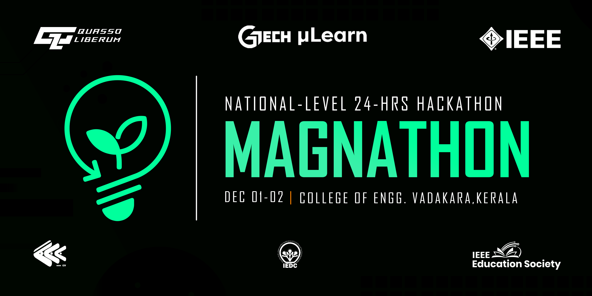

# Eco-Assist - MAGNATHON
Enabling people to contribute towards a sustainable future without even realising as they are driven by the rewards.  Improves the quality of public transport systems as the people are incentivised. Encourages the use of alternate sources of energy. Promote the use of eco-friendly products through the redeem codes availed to them.  Gives them a strong reason to participate in a sustainable appraoch as they get hand-on rewards rather than a promise of a better future.

## Team Members
[1.AHAMMED SHIBINSHA K K](https://github.com/ShibinSha07)   
[2.BASSAM ELACHOLA](https://github.com/BassamEC)   
[3.ANKITH P VINOD](https://github.com/ANKITHPVINOD)   
[4.ADHIL RUMAIS]()   

## Link to Project
[Embed the live link of project](https://ankithpvinod.github.io/Eco-Assist/)

## How it Works ?
Fetches data of a particular user and displays it statistically using Django. Credits of each person are fetched and compared with others data on a specified interval. Data from QR is also scanned and inputted into the interface as credits.

## Technologies used
HTML,CSS,JAVA SCRIPT,GIT HUB

## How to configure
Instructions for settin

## How to Run
Instructions for running

## Other Links
Provide any other linksac
